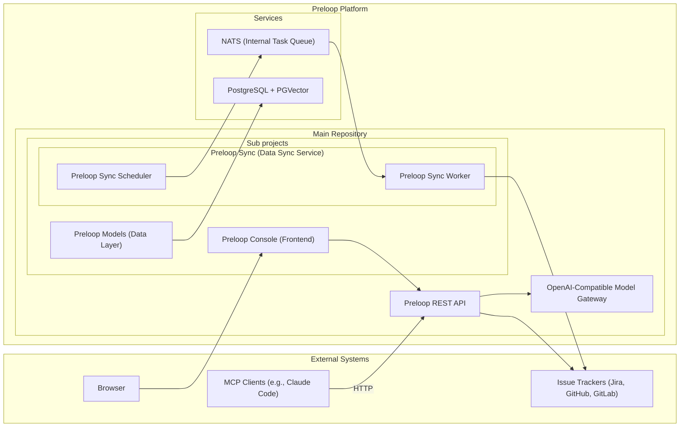

# Preloop Architecture

Preloop is an open-source, responsible AI automation platform. It can proxy tools from MCP servers, optionally adding a human approval layer with configurable policies. It provides event-driven agentic flows to intelligently automate common tasks using agent frameworks like Claude Code, Codex CLI, OpenCode, Gemini CLI, Aider or OpenHands. It integrates with issue & code tracking systems like Jira, GitHub, GitLab, both for listening to events and for ingesting issues, comments, documentation and code. By leveraging vector-based similarity search, Preloop detects duplicate and overlapping issues, detects unmapped dependencies, evaluates compliance metrics, and offers intelligent suggestions to streamline workflows. The architecture now also includes Preloop-owned model-gateway surfaces so managed runtimes can route model traffic through a central enforcement point for telemetry, budgets, session observability, and secret custody. The architecture emphasizes flexibility, performance, and ease of integration, providing access via a REST API, a web UI, and an MCP server for various clients.

ARCHITECTURE.md is the map. Read one chapter under `docs/architecture/` for the subsystem you are changing. Do not load every chapter for context.

Implementation PRs can use [durable feedback subscriptions](docs/guide/flows/durable-implementation-feedback.md): PostgreSQL threads and inbox leases coordinate new execution turns, while native conversation artifacts remain isolated from workspace checkpoints. Repository events and bounded reconciliation advance CI/review gates without idle agent containers.

## High-Level Architecture

## Chapters

| Chapter | What it covers |
|---|---|
| [Overview](docs/architecture/overview.md) | High-level layout, key components, and the REST search path. Start here for how the API, console, sync, and gateway fit together. |
| [Frontend](docs/architecture/frontend.md) | Console structure (Lit, Vite, TypeScript, Shoelace). Tracker detail, tools page, and cost views. |
| [Model gateway](docs/architecture/gateway.md) | OpenAI- and Anthropic-compatible ingress, accounting, budgets, and runtime session identity. |
| [Governance](docs/architecture/governance.md) | Subject-scoped allowed models, tool access rules, and tool output filters. |
| [Approvals](docs/architecture/approvals.md) | Tool configuration, human-in-the-loop approval workflows, `ask_user`, and native-tool permission-check. |
| [Agent Control](docs/architecture/agent-control.md) | Operator channel to managed agents, CLI/desktop enrollment, and mobile/watch voice contact. |
| [Cost](docs/architecture/cost.md) | `ApiUsage` ledger, OSS spend and budget-health surfaces, and the Enterprise plugin boundary. |
| [Sync](docs/architecture/sync.md) | Tracker polling, NATS scheduler/worker, issue tracker clients, and tracker scope rules. |
| [Data model](docs/architecture/data-model.md) | `preloop.models`, PostgreSQL + PGVector, schema, and backend project layout. |
| [MCP](docs/architecture/mcp.md) | FastMCP integration, dynamic tool filtering, and the HTTP MCP request path. |
| [Realtime](docs/architecture/realtime.md) | Unified WebSocket, MessageRouter topics, and account-scoped pub/sub. |
| [Security](docs/architecture/security.md) | Auth and tenancy, redaction, secret custody, security-screen scoring, and `preloop.security`. |
| [Decisions](docs/architecture/decisions.md) | Why FastAPI, Python, and PostgreSQL, and how the stack is deployed (Compose, Helm, service roles). |
| [Flows](docs/architecture/flows.md) | Event-driven agentic flows, remote runners, matrix/batch fan-out, eval artifacts, and evidence packs. |

Execution environment profiles and hosted checkpoint recovery are documented in
[Environments and recovery](docs/guide/flows/environments-and-recovery.md).
