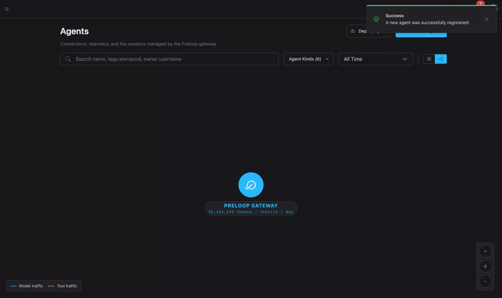
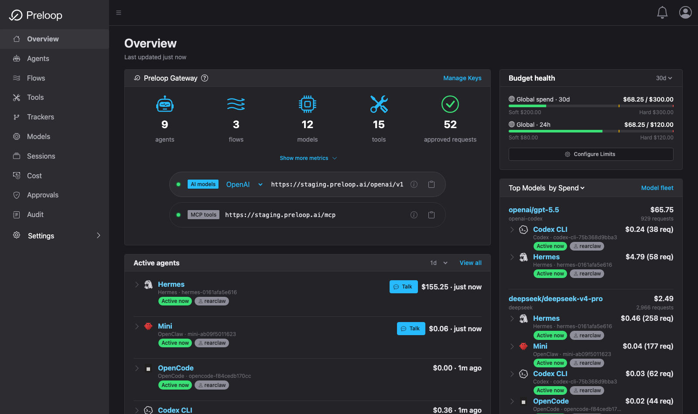
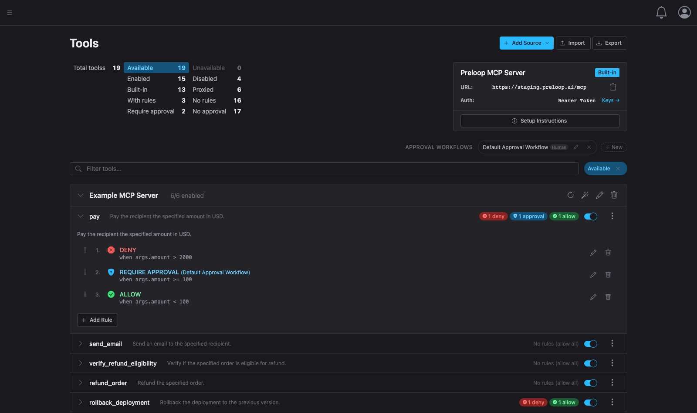
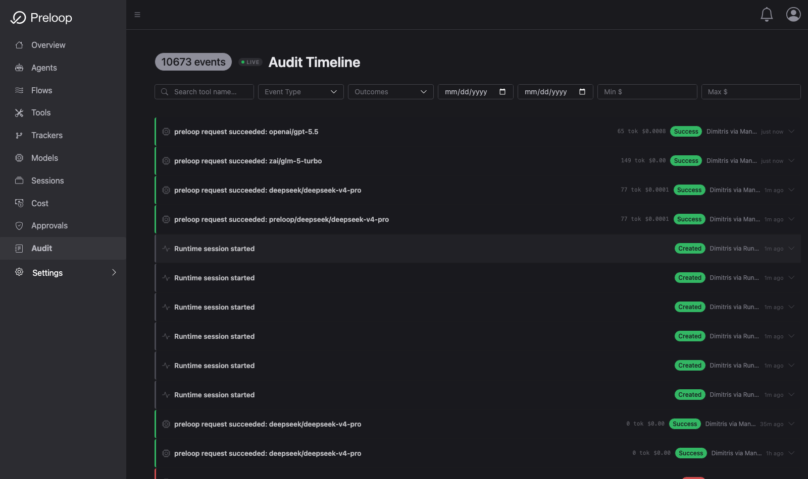

#  Preloop - The Open-Source AI Agent Control Plane

[](LICENSE)
[](https://www.python.org/downloads/)

**Preloop is the open-source AI agent control plane.** It unifies an **MCP firewall** for tool access, an **AI model gateway** for cost, safety and attribution, **policy-as-code** with **human approvals**, **runtime session observability**, and **audit trails** - in a single self-hostable platform.

Use Preloop to **onboard existing agents** with one command, and to **deploy event-driven agentic automations** with governed tools and budgets.

**Works with [OpenClaw](https://github.com/openclaw/openclaw), Claude Code, Codex CLI, Cursor, Gemini CLI, [Hermes](https://github.com/nousresearch/hermes-agent), [OpenCode](https://github.com/sst/opencode), Windsurf, and any MCP-compatible agent or managed runtime.**

Run `preloop agents discover` and Preloop will find local agent configs, import representable MCP servers and model metadata, mint managed runtime credentials, and rewrite supported agents to route tool calls through the **Preloop MCP Firewall** and model traffic through the **Preloop Gateway**. For Agent Control, the CLI provisions the credential/config contract and can delegate plugin installation to the runtime marketplace, but the plugin is what keeps the live control channel connected.


Build automations with templates like the [Pull Request Reviewer](./backend/presets/002-pull-request-reviewer.yaml), or write your own.

> **Official documentation:** Full guides and tutorials at [docs.preloop.ai](https://docs.preloop.ai).

Preloop has two parts: the **control plane** (API, console, MCP firewall, and model gateway — use [Preloop Cloud](https://preloop.ai) or self-host the open-source stack) and the **CLI**, which discovers your local agents and onboards them to whichever control plane you connect it to.

```bash
# 1. Install the CLI
curl -fsSL https://preloop.ai/install/cli | sh

# 2. Connect it to a control plane:
preloop signup                                # Preloop Cloud (fastest), or
preloop login --url http://localhost:3000    # your self-hosted instance (see Getting Started)

# 3. Bring your local agents under governance
preloop agents discover
```

<p align="center">
  
</p>

## Watch it work

A short series covering onboarding, the MCP firewall, human approvals, and cutting session cost — recorded end to end against a real stack, no slideware.

<p align="center">
  <a href="https://www.youtube.com/watch?v=Y_geb2Or8zM&list=PLr2Jp0c-Qn2hoYL3aRZGUtBjTCVygWIXt">
    
  </a>
</p>

<p align="center"><a href="https://www.youtube.com/watch?v=Y_geb2Or8zM&list=PLr2Jp0c-Qn2hoYL3aRZGUtBjTCVygWIXt"><b>Watch the full playlist &rarr;</b></a></p>

## What is Preloop?

Preloop is a single open-source platform that covers the five jobs teams otherwise buy from four different vendors:

| Capability | What it does | Alternatives |
|---|---|---|
| **MCP Firewall** | Govern every tool call an agent makes. Allow, deny, require approval, require justification. YAML + CEL policies. | MintMCP, Lunar.dev MCPX, TrueFoundry MCP Gateway |
| **AI Model Gateway** | OpenAI- and Anthropic-compatible gateway with per-account/flow budgets, allowed-model lists, token accounting, and runtime attribution. | Portkey, Helicone, LiteLLM, Kong AI |
| **Cost Analytics & Budgets** | Explain model spend by model, agent, session, API key, flow, and user; enforce budgets and inspect optimization opportunities. | FinOps dashboards, vendor billing exports |
| **Human Approvals** | Mobile, watch, Slack, Mattermost, email, or webhook notifications with one-tap decisions and full context. Approve any onboarded agent's tool calls — including native `Bash`/`Edit` — not just MCP tools. Async-safe. | Custom Slack bots, Peta Desk |
| **Runtime Observability** | Session-level timeline of tool calls, model calls, policy decisions, approvals, spend, and outcomes across agents. | AgentOps, Langfuse, LangSmith |
| **Audit & AI Act Evidence** | Durable logs with matched policy, approver, inputs, timestamps, and outcome. Ready for security review and EU AI Act work. | Credo AI, IBM watsonx.governance |

All shipped as Apache 2.0 software that runs on your infrastructure.

## Why Preloop?

AI agents like Claude Code, Cursor, and OpenClaw are transforming how we work. But agents now deploy code, touch production data, change infrastructure, and spend money — and traditional IAM, prompt rules, and manual review were never built for that.

- **Accidental deletions.** One wrong command and your production database is gone.
- **Leaked secrets.** API keys pushed to public repos before anyone notices.
- **Runaway costs.** Agents spinning up expensive cloud resources without limits.
- **Breaking changes.** Untested deployments to production at 3am.

Most teams face an impossible choice: give AI full access and move fast (but dangerously), or lock everything down and lose the productivity gains.

**Preloop solves this.** Govern what agents are allowed to do, route risky actions to the right human, attribute model spend to the right team, and keep a searchable record of every important decision — without rebuilding your stack or instrumenting SDKs.

```text
AI Agent → Preloop → [Policy check] → Allow / Deny / Require Approval → Execute
                   → [Gateway]       → Budget + attribution             → Model
```

## Core Capabilities

### Managed Agent Onboarding (`preloop agents discover`)
One command discovers and enrolls existing local agents into your control plane.

```bash
preloop agents discover
```

Preloop inspects local configurations for **Claude Code**, **Codex CLI**, **Cursor**, **Gemini CLI**, **[Hermes](https://github.com/nousresearch/hermes-agent)**, **[OpenClaw](https://github.com/openclaw/openclaw)**, **[OpenCode](https://github.com/sst/opencode)**, and other MCP-compatible runtimes, imports representable MCP servers and model metadata into your account, mints a durable credential, backs up the existing config, and rewrites supported local endpoints to Preloop-managed MCP and gateway URLs. Legacy and current config locations are supported, JSON5/YAML parsing included.

Managed onboarding has two layers: CLI provisioning and runtime behavior. The CLI can create credentials, write `preloop.control` configuration, and invoke runtime-native plugin installation where the target runtime supports that workflow. It cannot, by itself, make an unmodified agent process stay online for Agent Control. Live OpenClaw/Hermes Agent Control requires the standalone Preloop runtime plugin to be loaded in the agent process.

To make Talk appear for OpenClaw or Hermes, the agent must be active, have a
`preloop.control` block with a valid runtime bearer token, and have the Preloop
runtime plugin online. The normal CLI path is:

```bash
preloop agents onboard openclaw
preloop agents install-plugin openclaw
preloop agents validate openclaw

preloop agents onboard hermes
preloop agents install-plugin hermes
preloop agents validate hermes
```

After installing the plugin, restart the agent runtime. When the plugin connects
to `WS /api/v1/agents/control/ws` and advertises capabilities, Preloop marks the
Agent Control channel verified and the web/mobile Talk controls become available.
The plugin-only path uses the same contract: install `@preloop-ai/openclaw-plugin`
or `preloop-hermes-plugin`, provide a valid `preloop.control` block, start the
runtime, and let the plugin connect.

Don't have the runtime installed yet? `preloop agents install-runtime <hermes|openclaw>`
installs it locally and onboards it through Preloop in one step. To route an
agent's **native** tool calls (e.g. Claude Code `Bash`/`Edit`) through Preloop
approvals, onboard with `preloop agents onboard <agent> --approvals` — or just
answer yes when interactive onboarding offers it for supported agents.

<p align="center">
  
</p>

### Access Policies & Approval Workflows
Define fine-grained access controls for any AI tool or operation. Tools support multiple ordered access rules that evaluate in priority order. When an AI attempts a protected operation, Preloop pauses and notifies you:
- **Instant notifications** via mobile app, email, Slack, Mattermost, or custom webhook.
- **One-tap approvals** from your phone, watch, or desktop — for any onboarded agent's tool calls, including native `Bash`/`Edit` actions, not just MCP tools.
- **Async approval mode** lets the agent poll for status instead of blocking network hooks.
- **Agent questions** — beyond allow/deny, agents can call the built-in `ask_user` tool to ask the operator a question with multiple-choice options and/or a free-text reply, and get the answer back. Rendered as option buttons + an answer field in the mobile and watch apps.
- **Per-tool justification** — require (or optionally request) the agent to explain *why* a tool is being called.
- **Full Audit Trail** — every action is logged with full context: what was attempted, the matched policy, execution duration, and who approved it.

<div align="center">
  
  
</div>

### Policy-as-Code
Define policies in YAML and manage via CLI or API to version-control your safeguards alongside your infrastructure:

```yaml
# Example: Require approval for production deployments
version: "1.0"
metadata:
  name: "Production Safeguards"
  description: "Require approval before deploying"

approval_workflows:
  - name: "deploy-approval"
    timeout_seconds: 600
    required_approvals: 1
    async_approval: true

tools:
  - name: "bash"
    source: mcp
    approval_workflow: "deploy-approval"
    justification: required
    conditions:
      - expression: "args.command.contains('deploy') && args.command.contains('production')"
        action: require_approval
```

### AI Model Gateway
Preloop safely routes model traffic on behalf of managed runtimes instead of handing provider credentials to potentially vulnerable agent containers.
- **OpenAI-compatible** (`/openai/v1/models`, `/openai/v1/chat/completions`, `/openai/v1/responses`) and **Anthropic-compatible** (`/anthropic/v1/messages`) endpoints with SSE streaming.
- **Budget enforcement** at account, flow, and subject scopes using configurable cost tracking limits.
- **Allowed-model lists** per account, flow, API key, or managed agent.
- **Usage accounting** persisted as a canonical `ApiUsage` ledger — token usage, estimated cost, runtime-principal attribution, and provider-neutral conversation previews.
- **Secret custody** — provider API keys stay with Preloop; runtimes receive short-lived gateway tokens instead of raw credentials.

### Cost Analytics & Budgets
Preloop makes model spend explainable, not just counted. The Console has a dedicated **Cost** area with subviews that help operators answer:

- **How much have we spent?** Spend, token volume, and request counts over time by model, provider, account, flow, managed agent, runtime session, API key, and user.
- **Who or what spent it?** Attribution from `ApiUsage`, runtime principals, subject-scoped governance, and session timelines.
- **Why was it spent?** Drill-down from aggregate charts into session transcripts, model-call previews, tool calls, approvals, and flow outcomes.
- **Was the outcome worth it?** Enterprise analysis can use the account's default AI model to summarize sessions, compare spend against observed outcome, and flag low-value or failed runs.
- **How could it be optimized?** Session optimization recommendations can suggest cheaper models, prompt reductions, caching, batching, retry suppression, budget policy changes, or approval gates for expensive workflows — with one-click apply and replay-verified savings.

The open-source edition includes a practical Cost Overview with Agents/Tools/Sessions/Users drill-downs, per-tool usage stats, budget-health alerts from gateway account/flow limits, MCP tool output filters that strip wasteful fields from tool results, gateway context optimization on the hot path, and the full session-optimization value loop — evidence-grounded waste findings per runtime session, one-click apply with applied-action outcome tracking, and consent-gated replay verification of savings — powered by your own model keys (BYOK). Preloop Cloud and Preloop Enterprise add budget policy configuration and enforcement, negotiated provider pricing overrides (including non-USD contract rates), provider billing reconciliation (estimated spend vs. the actuals reported by the OpenAI and Anthropic billing APIs), historical usage repricing, analysis on hosted models without your own keys, FinOps workflows, AI-generated session value reviews and titles, anomaly detection, chargeback/showback, credits and promotions, forecasting, approval escalations, and export/reporting features through backend plugins. The frontend remains shared and exposes advanced panels through feature flags.

### Runtime Session Observability
A durable `RuntimeSession` layer gives you one timeline per managed runtime — flow executions today, and any onboarded CLI/desktop agent session going forward. Operator-scoped endpoints expose recent sessions plus captured gateway interactions so the console can drill from aggregate usage into a single session timeline. Operators can end a session explicitly; doing so updates runtime state, emits audit events, and refreshes managed-agent summaries.

### Agent Control
Preloop is evolving from an approval and gateway layer into **Agent Control** for long-running autonomous agents.

- **Implemented today:** account-scoped realtime topics, runtime-session identity, managed-agent enrollment, OpenClaw and Hermes config rewrites, MCP proxying, model-gateway routing, session timelines, operator lifecycle actions, `WS /api/v1/agents/control/ws`, and `POST /api/v1/agents/{agent_id}/control/commands`.
- **Scaffolded today:** console views for runtime sessions and managed agents, mobile/watch approval clients, WebSocket delivery for account events and approval updates, and native voice/dictation surfaces that can submit operator text turns.
- **Runtime-plugin dependent:** live OpenClaw and Hermes command delivery requires their native runtime plugin to honor `preloop.control.control_ws_url`, own reconnect/backoff and heartbeat/status loops, advertise capabilities, receive `send_message` envelopes, execute or inject operator messages into the active agent session, and keep any resulting tool/model work on the governed MCP and gateway paths. Without that plugin loaded, the agent can still be onboarded for MCP/gateway routing, but Agent Control is not enabled.
- **Voice surfaces:** the web console now supports inline Talk controls with browser-native STT/TTS first and server STT/TTS fallback through speech-capable `AIModel` rows. Mobile/watch apps should continue to prefer vendor-native speech APIs and submit normalized voice transcripts through the same Agent Control surface.
- **Planned next:** hardened command persistence/recovery, interruption semantics, richer status streaming, and production voice UX on mobile and watch.

Agent Control surfaces are intentionally layered: the web console is the primary operator surface for managed-agent presence, session context, and text commands; mobile apps add push-to-talk or typed handoff for urgent operator messages; Apple Watch favors short dictated replies and quick status/approval actions.

Agent Control messages are auditable user/operator turns for a selected runtime session. They are not hidden system prompts or policy overrides; any tool or model work they trigger still flows through the MCP firewall, model gateway, budget checks, and approval policies.

Siri and Google Assistant should be treated as invocation and handoff surfaces, not reliable arbitrary background agent transports. Native app code can capture intent, permissions, and user confirmation; Preloop keeps the authoritative control, audit, and agent-message state on the server.


## Getting Started

The CLI is a client: it needs a Preloop control plane to talk to. Pick one of two paths — both use the exact same CLI, console, and features.

### Option A: Preloop Cloud (fastest)

Use the hosted control plane at [preloop.ai](https://preloop.ai) — nothing to run yourself:

```bash
curl -fsSL https://preloop.ai/install/cli | sh
preloop signup          # opens the browser to create your account and authenticates the CLI
preloop agents discover
```

### Option B: Self-host the open-source stack

Run the full control plane on your own machine or infrastructure, then point the CLI at it:

```bash
# Install and start the OSS stack (Docker Compose, data stays on your machine)
curl -fsSL https://preloop.ai/install/oss | sh

# Install the CLI and connect it to YOUR instance instead of preloop.ai
curl -fsSL https://preloop.ai/install/cli | sh
preloop login --url http://localhost:3000
preloop agents discover
```

The console is at `http://localhost:3000` — create the first user there or let `preloop login` walk you through it. You can also set the instance URL via the environment (`PRELOOP_URL=http://localhost:3000 preloop login`); the CLI stores it in `~/.preloop/config.yaml`, so every later command targets your instance. Without `--url` or `PRELOOP_URL`, the CLI defaults to `https://preloop.ai`.

#### Public deployments: HTTPS and email

The installer asks for the public URL of the instance and for SMTP settings, or takes them from the environment. Give it a public `https://` URL and it provisions a TLS certificate with Let's Encrypt (certbot) automatically, putting an nginx proxy in front of the stack and renewing the certificate every 12 hours:

```bash
curl -fsSL https://preloop.ai/install/oss | \
  PRELOOP_URL=https://preloop.example.com \
  PRELOOP_TLS_EMAIL=ops@example.com \
  SMTP_HOST=smtp.example.com SMTP_USERNAME=preloop@example.com \
  SMTP_PASSWORD=... SMTP_FROM=preloop@example.com sh
```

`preloop.example.com` must already resolve to the machine, and ports 80/443 must be free. Certificates are only requested for public DNS names — `localhost`, bare IPs and `.local` hosts are left on plain HTTP. Useful knobs: `PRELOOP_TLS_STAGING=1` (rehearse against the Let's Encrypt staging CA), `PRELOOP_SKIP_TLS=1` (keep the https URL but terminate TLS yourself, e.g. behind a load balancer), `PRELOOP_SKIP_SMTP=1` (never prompt for email).

**Email is not optional in practice**: approval requests, invitations and password resets are delivered by email, so an instance without SMTP cannot notify approvers. Everything the installer writes lives in `~/.preloop-oss/.env` — edit it and run `docker compose up -d` to change any setting later.

To install a pre-release (e.g. a release candidate), pin the version: `curl -fsSL https://preloop.ai/install/oss | PRELOOP_VERSION=0.12.6 sh` (the same works for the CLI installer).

#### Upgrading

Re-run the same install command — it upgrades in place:

```bash
curl -fsSL https://preloop.ai/install/oss | sh
```

The installer detects the existing install and keeps its configuration (public URL, TLS setup, SMTP credentials, `SECRET_KEY`, database password), pulls the new images, **dumps the database to `~/.preloop-oss/backups/` first**, applies schema migrations automatically (the `migrate` service runs `alembic upgrade head`), and removes containers for services a new version dropped. Setting an environment variable overrides that one setting; everything else is preserved.

For Kubernetes/prod-like deployments, use the Helm chart in [`helm/preloop`](helm/preloop) and connect the CLI with `preloop login --url https://your-preloop.example.com`.

### Telemetry

Self-hosted instances and the CLI send a daily, pseudonymous version check-in (random UUID, version, platform — no user data), which also carries one-time `install_completed` / `cli_first_run` markers. Set `PRELOOP_DISABLE_TELEMETRY=true` (in the instance `.env`, or in the CLI's environment) to disable it entirely; the bash installer itself never phones home. The complete event and field list is in [SECURITY.md](SECURITY.md#telemetry).

### Release smoke test

Every tagged release is verified automatically before it is published: the `verify-oss-install` job in the release workflow runs [`scripts/release_smoke_test.sh`](scripts/release_smoke_test.sh), which boots `docker-compose.release.yaml` with the tagged images, checks API/gateway/console health, exercises first-user sign-up and login, and fails if any service restart-loops. You can run the same script locally with `PRELOOP_VERSION=0.12.6 ./scripts/release_smoke_test.sh`.

For hosted trials, additionally verify that the public URL loads the console, `/api/v1/health` responds, first-user sign-in or sign-up works, `preloop agents discover` can target the public URL, one gateway model call appears in the UI, and one MCP policy event appears in the audit timeline.

For extended details detailing comprehensive Docker builds, Kubernetes Helm topologies, GraphQL configuration, WebSocket streaming channels, and deep `.env` definitions, refer to the [Preloop Documentation Hub](https://docs.preloop.ai).

> **Production requirement:** The `SECRET_KEY` environment variable is **required** in production. Without it, the application will refuse to start. In development, a default key is used with a warning. Generate a secure key with: `python -c "import secrets; print(secrets.token_urlsafe(32))"`

## The Open-Source Alternative to AWS Bedrock AgentCore

Preloop covers the same core jobs as AWS Bedrock AgentCore (runtime, gateway, identity, observability, policy) but is open source, self-hostable, MCP-native, and vendor-neutral. Many teams adopt Preloop specifically as an **open-source alternative to AWS Bedrock AgentCore** when they want to avoid hyperscaler lock-in or need to run governance inside their own VPC or on-prem.

| Feature | Preloop | AWS Bedrock AgentCore |
|---------|:-------:|:--------------:|
| Open source (Apache 2.0) | ✅ | ❌ |
| Self-hostable (VPC / on-prem) | ✅ | ❌ |
| Policy-as-code (YAML + CEL) | ✅ | Limited |
| MCP-native tool governance | ✅ | Partial |
| Model gateway with budgets & attribution | ✅ | ✅ |
| Human-in-the-loop approval workflows | ✅ (mobile, Slack, webhook) | Limited |
| Works with any agent runtime | ✅ | AWS-centric |
| Vendor lock-in | None | AWS |
| Onboard existing local agents with one command | ✅ (`preloop agents discover`) | ❌ |

## How Preloop Compares to Other Categories

| Category | Common tools | How Preloop differs |
|---|---|---|
| **AI gateways / LLM proxies** | Portkey, Helicone, LiteLLM, Kong AI | Preloop's gateway is bundled with an MCP firewall, approval workflows, and runtime observability — you do not need to stitch four products together. |
| **MCP gateways** | MintMCP, Lunar.dev MCPX, TrueFoundry | Preloop is open-source and includes a first-class AI model gateway, not just MCP tool routing. |
| **AgentOps / observability** | Langfuse, LangSmith, Braintrust, AgentOps.ai | Preloop adds runtime *enforcement* (policy, approvals, budgets), not just tracing. |
| **AI runtime security** | Lakera, Lasso, Zenity, Noma | Preloop is developer-facing, MCP-native, and self-hostable. Complementary to semantic content-safety firewalls. |
| **AI governance suites** | Credo AI, IBM watsonx, OneTrust | Preloop focuses on runtime controls agents actually hit, not just top-down inventory and risk artifacts. |

## Editions

Preloop ships in three editions built on the same core:

- **Preloop** — the open-source edition (Apache 2.0, this repository), self-hosted.
- **Preloop Cloud** — the hosted service at [preloop.ai](https://preloop.ai); nothing to run yourself.
- **Preloop Enterprise** — the commercial edition for self-hosting on your own infrastructure (on-prem or private VPC).

Preloop Cloud and Preloop Enterprise extend the core open-source components with centralized RBAC and advanced governance capabilities:

| Feature | Open Source | Enterprise |
|---------|:-----------:|:----------:|
| Basic approval workflows | ✅ | ✅ |
| Issue tracker integrations | ✅ | ✅ |
| Agentic flows & Vector search | ✅ | ✅ |
| **Cost overview, usage drill-downs & budget-health tracking** | ✅ | ✅ |
| **Budget policy configuration & enforcement** | ❌ | ✅ |
| **Per-account model price overrides** | ❌ | ✅ |
| **Provider billing reconciliation & usage repricing** | ❌ | ✅ |
| **Role-Based Access Control (RBAC)** | ❌ | ✅ |
| **Team management & Admin Dashboard** | ❌ | ✅ |
| **CEL conditional approval workflows** | ❌ | ✅ |
| **AI-driven approval logic** | ❌ | ✅ |
| **Team-based approvals with quorum** | ❌ | ✅ |
| **Approval escalation** | ❌ | ✅ |
| **AI session value reviews & spend optimization recommendations** | ❌ | ✅ |
| **Credits, promotions, chargeback/showback & forecasting** | ❌ | ✅ |

Contact sales@preloop.ai for Preloop Enterprise licensing requests.

## Contributing

Contributions are welcome! Please see our [Contributing Guidelines](CONTRIBUTING.md) for details on how to get started.

## License

Preloop is open source software licensed under the [Apache License 2.0](LICENSE).
Copyright (c) 2026 Spacecode AI Inc.
