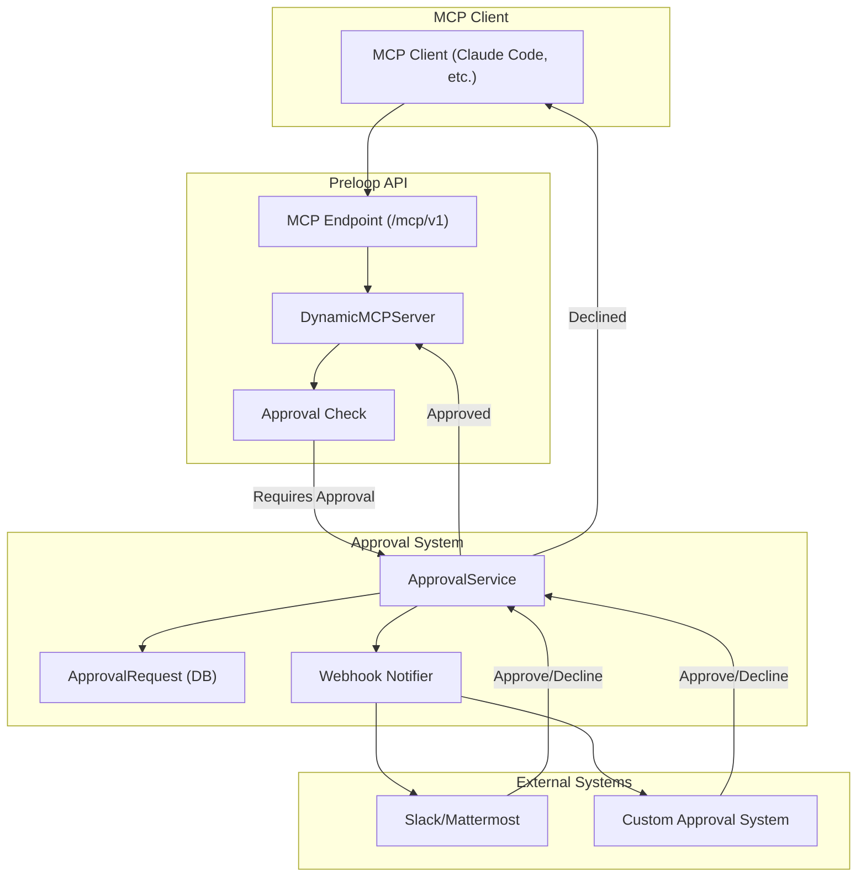

# Tool Configuration and Approval Workflow

Tool configuration records which tools are enabled and whether they need a human in the loop. This chapter covers approval workflows, the permission-check path for native tools, and `ask_user`.

## Tool Configuration and Approval Workflow

Preloop includes comprehensive infrastructure for managing tool configurations and implementing human-in-the-loop approval workflows for sensitive tool operations.

### Tool Configuration Management

**Database Models:**
- **`ToolConfiguration`**: Defines which tools are enabled for an account, their configuration parameters, and approval requirements
  - Links to an optional `ApprovalWorkflow` for tools requiring human approval
  - Supports both default (built-in) and proxied (external MCP server) tools
  - Stores tool-specific configuration in JSONB format

- **`ApprovalWorkflow`**: Defines rules for when and how tool executions require approval
  - Configurable approval modes: manual, auto-approve, auto-reject
  - Optional webhook integration for external approval systems
  - Supports workflow-specific settings (e.g., timeout duration, required approvers)

### Approval Workflow Architecture

**Approval Flow:**
1. MCP client initiates a tool call through the `/mcp/v1` endpoint
2. `DynamicMCPServer` checks if the tool requires approval via `_check_approval_required()`
3. If approval is required:
   - `ApprovalService.create_and_notify()` creates an `ApprovalRequest` record
   - Webhook notifications are sent to configured channels (Slack, Mattermost, custom endpoints)
   - The service waits for approval with configurable timeout
4. Approver reviews request and responds via:
   - Public approval API endpoint (`/approval/{request_id}/decide`)
   - Direct API call to Preloop
5. On approval, tool execution proceeds; on decline, error is returned to client

**API Endpoints:**
- `GET /api/v1/tool-configurations` - List all tool configurations for account
- `POST /api/v1/tool-configurations` - Create new tool configuration
- `PUT /api/v1/tool-configurations/{id}` - Update tool configuration
- `DELETE /api/v1/tool-configurations/{id}` - Delete tool configuration
- `GET /api/v1/approval-workflows` - List approval workflows
- `POST /api/v1/approval-workflows` - Create approval workflow
- `GET /api/v1/approval-requests` - List approval requests
- `GET /approval/{id}/data` - Public endpoint for getting approval request details (token-based)
- `POST /approval/{id}/decide` - Public endpoint for approval responses (token-based)
- `POST /api/v1/agents/permission-check` - Lets an onboarded agent raise an approval for one of its **native/built-in** tool calls (not just MCP tools), authenticated with the agent's managed-runtime credential. It reuses `ApprovalService.create_and_notify` → `wait_for_approval` and blocks until decided, returning `{"decision":"allow"|"deny","reason","request_id","timed_out"}` (deny is the safe default). `timed_out: true` marks a deny that is only the expiry of an unanswered approval request — not a human decision — so hook adapters whose host has a native "ask" verdict (e.g. Claude Code PreToolUse hooks) can hand the prompt back to the agent's local UI instead of hard-denying; adapters without an ask verdict keep the fail-closed deny. The request's non-sensitive originating adapter travels as a `_preloop_source` marker inside `tool_args` so approver surfaces can distinguish e.g. a Cursor-originated `Write` from a Claude Code one without a schema migration. Native access rules on the agent-source configuration are evaluated before the hook's `client_decision` is honoured, and a matching rule wins (a blocked tool is denied without creating an approval).

**Agent questions (`ask_user`).** Beyond allow/deny gating, the built-in `ask_user` MCP tool lets an agent ask the operator a question with multiple-choice `options` and/or a free-text answer, routed through the same approval workflow, notification, and audit pipeline. The question payload (`is_question`, `question`, `options`, `allow_free_text`) rides in the approval request's `tool_args` JSONB (no schema migration) and is surfaced on `ApprovalRequestResponse` as computed fields. The operator's reply is submitted via the same decision endpoints, where `ApprovalDecision` now accepts `selected_option`/`answer_text` (precedence: `answer_text` > `selected_option` > `comment`); the resulting text is returned to the agent as the tool result. Mobile/watch render options as buttons plus an answer field. When the question was resolved through a synchronous approval, `ask_user`'s return carries an approval audit trailer — `[approval_id: ...; answered_by: ...; answered_at: ...; status: ...]` — so an agent transcribing the human's decision (e.g. interactive waiver collection in the security-audit presets) can cite the governed approval record instead of asserting one. `answered_by` is resolved to the approver's email/username (raw id only as fallback); the metadata is scoped to the current `require_approval` call (cleared on entry, consumed once) so a stale approval can never be misattributed to a later question, and runs without an approval record keep the legacy return format unchanged.

**Managed-agent linkage:** `ApprovalRequest` carries optional `managed_agent_id`, `runtime_session_id`, and `managed_agent_name` fields, populated from the runtime token context so approval surfaces can show which agent is asking. The endpoint and these identity columns are part of the open-source core. The per-agent native-tool interception adapters (Claude Code, Codex CLI, Cursor, OpenClaw, Hermes) and any future central per-agent/global policy UI live in Preloop Enterprise / the CLI.

**Workflow resolution.** Every account gets a default approval workflow seeded at signup with the account owner as approver (a startup repair pass heals legacy defaults and seeds accounts that missed it). Operators can additionally pin a specific approval workflow per managed agent from the Console's agent detail view (Tools & Governance → Native tool approvals); the pin is stored in the agent's subject-governance config (`approval_workflow_id`) and wins over the account default when the permission-check endpoint resolves a workflow.

**Account governance defaults.** `GET/PUT /api/v1/account/governance-defaults` stores account-wide native tool-approval defaults in the account's subject-governance metadata. Per-agent settings resolve through an explicit chain: explicit per-agent value → account default → enforce (fail-closed). Overrides are bidirectional — an agent can opt out of a permissive account default or relax a strict one — and the defaults response lists the per-agent override ids so the Console (Tools view: account panel; agent detail: inherit/override controls) can render effective state without N+1 lookups. When no native access rule matches, those defaults still decide whether the call is recorded and sent to a human.

**Local decision mirroring.** The CLI permission hooks compute a `client_decision` that mirrors — never widens — the host agent's own policy before raising an approval. Claude Code mirroring follows Claude's precedence (bypassPermissions → deny rules → ask rules → acceptEdits → allow rules → safe reads → ask); workspace `Write`/`Edit` in default permission mode deliberately stays "ask" because stock Claude Code prompts for them, so auto-allowing would swallow approvals the operator expects to see. Cursor keeps its own workspace-edit auto-allow because auto-applying edits *is* Cursor's default behavior; slash-rooted paths are treated as absolute on every host OS (Windows `filepath.IsAbs` alone would misroute `/etc/passwd` down the workspace-local branch).
