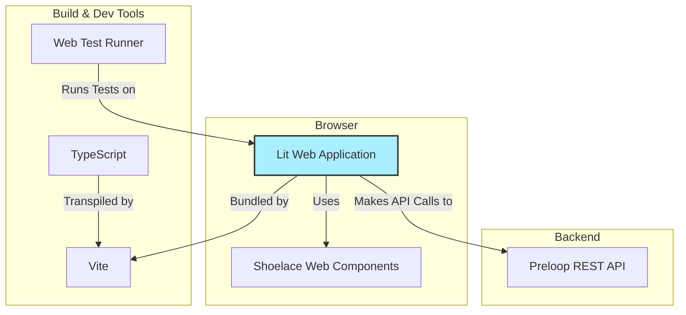

# Frontend Architecture

The Preloop Console lives in `frontend`. This chapter covers the Lit/Vite/TypeScript stack, directory layout, and the tracker, tools, and cost views.

The frontend is in the `frontend` directory.

## Technology Stack

*   **Framework:** [Lit](https://lit.dev/) - A simple library for building fast, lightweight web components. It provides reactive state, scoped styles, and a declarative templating system.
*   **Build Tool:** [Vite](https://vitejs.dev/) - A modern frontend build tool that provides an extremely fast development experience with features like Hot Module Replacement (HMR) and optimized production builds.
*   **Language:** [TypeScript](https://www.typescriptlang.org/) - A statically typed superset of JavaScript that enhances code quality and maintainability.
*   **UI Components:** [Shoelace](https://shoelace.style/) - A set of high-quality, standards-based web components.
*   **Testing:** [Web Test Runner](https://modern-web.dev/docs/test-runner/overview/) - A tool for testing web applications in a real browser, ensuring that components behave as expected in a live environment.

## Structure

The `Preloop Console` application is structured around a component-based architecture.

*   **`src/components/`**: This directory contains all the custom Lit components that make up the application. Each component is typically defined in its own file (e.g., `tracker-list.ts`) and may have a corresponding test file (e.g., `tracker-list.test.ts`).
*   **`src/api.ts`**: A dedicated module for handling communication with the Preloop REST API. It encapsulates fetch logic, authentication, and data transformation.
*   **`index.html`**: The main entry point for the application.
*   **`vite.config.ts`**: Configuration for the Vite build tool.
*   **`package.json`**: Defines project metadata, dependencies, and scripts for development, building, and testing.

### Tracker Detail Page (`src/views/authed/tracker-detail-view.ts`)

The Tracker Detail page is the entry point for issue analytics. Clicking a tracker card in the Trackers list navigates to `/console/trackers/:trackerId`, which shows:

*   **Tracker metadata:** Name, type, connection status, creation/update dates, URL, and scope rules.
*   **Issue Analytics cards:** Conditional links to Similarity, Compliance, and Dependencies views, gated by feature flags (`issue_duplicates`, `issue_compliance`, `issue_dependencies`). Each link pre-filters to projects belonging to that tracker via `?projects=` query parameters.
*   **Projects list:** All projects synced under this tracker.

Issue analytics features are no longer accessible from the main sidebar — they are scoped to individual trackers via this detail page.

### Overview and Attention (`src/views/authed/dashboard-control-plane-view.ts`, `attention-view.ts`)

The Overview (`/console`) leads with five current-state counts (agents, flows, models, tools, need attention), the two gateway endpoints (model gateway and tool firewall), a Usage card (tokens or estimated dollars over one page-wide time range, with global budget rows and the limits dialog), and activity cards. "Need attention" links to `/console/attention`, which lists pending approvals, agents with setup or live-check problems, flows with failed runs, models with gateway failures, budgets over their soft or hard limit, and a stale price catalog. Both views derive their items with `utils/attention.ts` (`deriveAttentionItems`, pure) from the same inputs fetched by `utils/attention-data.ts` (`loadAttentionInputs`), so the hero count and the page agree. Any row except a pending approval can be dismissed ("expected", "snoozed for N days", or "fixed"), and a dismissal is stored server-side against the item's fingerprint — the client's summary of why the item is showing (the latest failed run id, the agent's onboarding, validation and latest-session failure state, the sorted list of unpriced aliases) — so the item stays hidden only while that reason is unchanged and comes back by itself when it is not. The dismissals live behind `GET/PUT/DELETE /api/v1/attention/dismissals[/{item_id}]`: reading is open to any account member so the inbox renders the same for everyone, writing takes `manage_agents`, and the console hides the Dismiss/Restore controls (rather than showing buttons that 403) from members without it or against a server that predates the endpoint.

### Console surfaces (`src/styles/console-surfaces.css`, `console-styles.css`)

Every console background comes from one surface ladder declared per theme at document level: `--console-page`, `--console-surface`, `--console-surface-raised`, and `--console-hairline`. Declaring them on the document matters because Shoelace's dark theme is a class on `<html>` that shadow-scoped CSS cannot select, while custom properties inherit into every shadow root. In dark mode the ladder gets lighter with elevation (cards carry no border or shadow; the lightness step is the elevation); in light mode cards keep a hairline and the smallest shadow. Two rules follow from it and are enforced across the views: a depth limit of two (page, then surface: nothing inside a card gets a filled box of its own; rows separate by hairline), and states are tints, not paint (status chips are a 16% tint of their tone with dark ink; solid fills survive only on section count badges and the danger pill of a failed run). The design rationale lives in the private `DESIGN.md` (D27).

### Tools Page (`src/views/authed/tools-view.ts`)

The Tools page has been redesigned from a card-based layout to a tree-style list view:

*   **Summary stats table:** Interactive statistics panel showing tool counts (total, available/unavailable, enabled/disabled, built-in/proxied, with rules/no rules, require approval/no approval, approval workflows). Each stat is a clickable filter link.
*   **Unified filter system:** Single active filter at a time, text search, and approval workflow filter dropdown.
*   **Tool groups:** Tools grouped by source — external MCP servers listed first, then HTTP tools, then built-in tools.
*   **Import/Export:** Full configuration export/import as YAML.
*   **Key components:**
    *   `tool-list-item.ts` — Individual tool row with expand/collapse, enable/disable toggle, rule summary badges, and drag-and-drop rule reordering.
    *   `tool-rule-editor.ts` — Dialog for creating/editing access rules with action selection (deny/require approval/allow), condition builder (simple or CEL), and approval workflow configuration (human or AI-driven).
    *   `approval-policy-dialog.ts` — Dialog for creating/editing approval workflows.
*   **Access rule UI semantics:** Actions use semantic icons and colors — Deny (red, `x-octagon-fill`), Require Approval (blue/primary, `shield-lock-fill`), Allow (green, `check-circle-fill`).

### Cost Analytics Area (`src/views/authed/cost-*`)

The Console exposes a dedicated Cost section (`cost-view.ts`, sidebar "Cost") rather than scattering spend data across gateway, sessions, and settings pages. The shared frontend renders both OSS and Enterprise panels, gated by feature flags returned by the API (`billing`, `model_price_overrides`, `session_optimization`).

Core open-source subviews:

*   **Overview:** Date-range spend, token volume, request count, budget utilization, and budget-health cards, with sortable Agents / Tools / Sessions / Users tabs.
*   **Breakdown:** Groupable tables and charts by model, provider, managed agent, runtime session, flow, API key, and user, backed by `/api/v1/cost/*` and `GET /api/v1/tools/stats` (per-tool call counts, schema-injection token estimates, and spend attribution).
*   **Budgets:** OSS surfaces account/flow gateway limits and burn-rate health; budget policies support notification recipients (`notification_user_ids`, `notification_team_ids`). Enterprise billing plugin owns scoped budget policy CRUD, enforcement, and notification workflows.

Enterprise feature-flagged subviews (via `plugins/billing/`):

*   **Pricing:** Per-account model price overrides for input/output/cache tokens, fixed request costs, currency, effective date, and provider-specific metadata.
*   **Session Value:** LLM-generated summaries that explain what happened in a session, whether the outcome appears worth the spend, and which expensive attempts failed or retried.
*   **Optimization:** Recommendations for cheaper model routing, prompt compaction, caching, batching, retry suppression, or policy changes.
*   **Forecasting & Anomalies:** Burn-rate forecasts, unusual spend detection, alerts, chargeback/showback, and export workflows.
