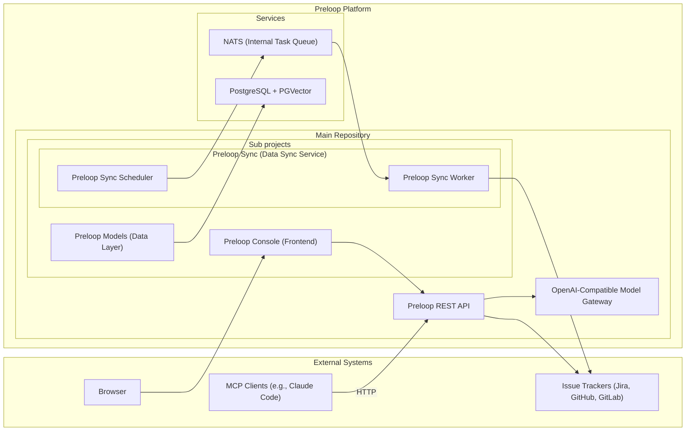

# System Overview

Preloop is an open-source, responsible AI automation platform with a REST API, web console, MCP server, and model gateway. This chapter is the system map: the high-level diagram, key components, the API server, and the REST search path.

Preloop is an open-source, responsible AI automation platform. It can proxy tools from MCP servers, optionally adding a human approval layer with configurable policies. It provides event-driven agentic flows to intelligently automate common tasks using agent frameworks like Claude Code, Codex CLI, OpenCode, Gemini CLI, Aider or OpenHands. It integrates with issue & code tracking systems like Jira, GitHub, GitLab, both for listening to events and for ingesting issues, comments, documentation and code. By leveraging vector-based similarity search, Preloop detects duplicate and overlapping issues, detects unmapped dependencies, evaluates compliance metrics, and offers intelligent suggestions to streamline workflows. The architecture now also includes Preloop-owned model-gateway surfaces so managed runtimes can route model traffic through a central enforcement point for telemetry, budgets, session observability, and secret custody. The architecture emphasizes flexibility, performance, and ease of integration, providing access via a REST API, a web UI, and an MCP server for various clients.

## High-Level Architecture

**Key Components:**

*   **Preloop REST API:** The core FastAPI application providing the HTTP interface.
    It now also exposes Preloop-owned model-gateway surfaces for managed runtime traffic.
*   **Preloop Models:** Handles database interactions, defining SQLAlchemy models, Pydantic schemas, and CRUD operations. Manages the PostgreSQL database connection and PGVector operations.
    This layer now includes `SecretReference` for provider credentials, `ApiUsage` gateway attribution for model usage, costs, and runtime principals, and account-scoped model pricing metadata used by cost analytics.
*   **Preloop Sync:** A service responsible for polling external issue trackers, processing data, generating embeddings, and storing/updating information in the database via `Preloop Models`. The preloop-sync cli can launch one-off scan operations, or start the scheduler process that adds polling tasks to the NATS queue. The NATS queue is consumed by the Preloop Sync worker process.
    *   **Preloop Sync Scheduler:** A process that adds polling tasks to the NATS queue.
    *   **Preloop Sync Worker:** A process that consumes tasks from the NATS queue and processes them.
    *   **Flow execution workers:** When `FLOW_EXECUTION_WORKER_ENABLED` is true, flow orchestration (`FlowExecutionOrchestrator`) runs on a dedicated sync worker pool (`execute_flow` / `resume_flow_execution`) instead of `asyncio.create_task` in the API or webhook worker. Workers claim a `flow_execution` row via a DB lease (`orchestrator_worker_id` + heartbeat), ack JetStream after claim, and publish `flow-updates.{id}` for console WebSockets. API replicas only create PENDING rows and dispatch; recovery re-publishes stale/unclaimed executions on the flow-execution pool boot.
*   **Preloop Console:** A web application built using Lit, Vite, TypeScript, and Material Web Components.
*   **PostgreSQL + PGVector:** The database storing metadata and vector embeddings.
*   **NATS:** An event bus used for both a reliable task queue (JetStream) and real-time streaming updates. It decouples the API from the background processing of events and flows.
    Gateway model-call events can be emitted into the same execution update channel used by flow runtime updates, and the same pattern should later support non-flow runtime sessions.
*   **External Systems:** Issue trackers and MCP clients interacting with the Preloop ecosystem.

## Preloop API Server (Main Repository)
*   **Framework:** FastAPI-based RESTful API server.
*   **Authentication:** JWT authentication and authorization.
*   **MCP Server:** Includes integrated MCP tool endpoints under `/api/v1/mcp/` for direct communication with MCP clients over HTTP.
*   **Validation:** Request validation using Pydantic models (defined in `preloop.models`).
*   **Documentation:** Automatic API documentation with Swagger/ReDoc.
*   **Features:** Rate limiting, error handling, monitoring integration.
*   **Interaction:** Communicates with `preloop.models` for database operations, directly with Issue Tracker APIs for certain actions (e.g., creating/updating issues in real-time), and with LiteLLM/provider APIs through the model gateway path.

## Operations: database pool sizing and readiness

Each API process opens two SQLAlchemy connection pools (a sync engine and an
async engine in `preloop.models.db.session`), plus one connection for a
dedicated health-check engine. So a process's connection ceiling is
`(pool_size + max_overflow) * 2 + 1`. Helm sets `DATABASE_POOL_SIZE` and
`DATABASE_MAX_OVERFLOW` per component (`values.yaml` under `database.pool`,
currently api `8+12`, gateway `6+14`, worker `2+4`); the code defaults in
`_database_pool_kwargs()` (`preloop/models/db/session.py`) apply only where
those are not set, such as a local `docker compose up`, and are sized (`10+20`)
to fit a stock Postgres `max_connections` of 100 on their own.

`pool_timeout` is 5 seconds, not the SQLAlchemy default of 30. A request that
cannot get a connection in 5 seconds has already lost interest; holding it
(and, before the 2026-09-03 fix, the event loop under it) for 30 seconds only
grows the queue behind it. A `sqlalchemy.exc.TimeoutError` on a saturated pool
renders as `503` with `Retry-After` instead of a generic `500`.

`GET /api/v1/health` reports each engine's checked-out/pool-size numbers and a
`saturated` flag, plus the usage-writer queue counters (see
`api_usage_recorder.py`). It deliberately does not fail readiness on
saturation: taking a saturated pod out of the load balancer concentrates the
same traffic on the remaining pods, which is the failure mode a full pool
already causes on its own.

Synchronous database work in `async def` handlers must not run inline: a
`Session` checks out its connection on first use, so an `async def` handler
that blocks on a full pool blocks the event loop under it, including
dependency-free routes like the liveness probe `GET /api/v1/ping`. Use
`preloop.api.loop_safety.run_db_off_loop` (or an async session where one is
already in scope) for handlers on request paths that can burst, such as
per-model or per-session console fan-out. `backend/tests/api/test_event_loop_pool_wait.py`
ratchets the set of async handlers still holding a synchronous session and
pins that a saturated pool on a hot path leaves `/api/v1/ping` responsive.

Usage telemetry (`log_usage_sync` in `preloop/api/app.py`) is written through
a bounded queue (`ApiUsageRecorder`, `API_USAGE_QUEUE_SIZE` default 1000) by a
small fixed pool of writer threads (`API_USAGE_WORKERS`, default 2) that batch
rows into one session (`API_USAGE_BATCH_SIZE`, default 50). Set
`API_USAGE_LOGGING_ENABLED=false` to disable usage rows entirely (default
`true`). When the queue is full the row is dropped and counted, rather than
every request paying for its own logging connection under load.

## REST API Flow (e.g., Searching Issues)
1.  **Client Request:** An HTTP client sends a `GET /api/v1/issues/search` request to the Preloop API server.
2.  **API Server:**
    *   Authenticates the request (JWT).
    *   Validates query parameters (using Pydantic models from `preloop.models`).
    *   Calls the appropriate service function.
3.  **Service Layer (API):**
    *   Generates an embedding for the search query.
    *   Calls a function in `preloop.models` to perform a vector similarity search in the PostgreSQL/PGVector database, potentially with metadata filters.
4.  **preloop.models:**
    *   Constructs and executes the SQL query against the database.
    *   Retrieves matching issue data.
5.  **API Server:** Formats the results and returns the HTTP response to the client.
