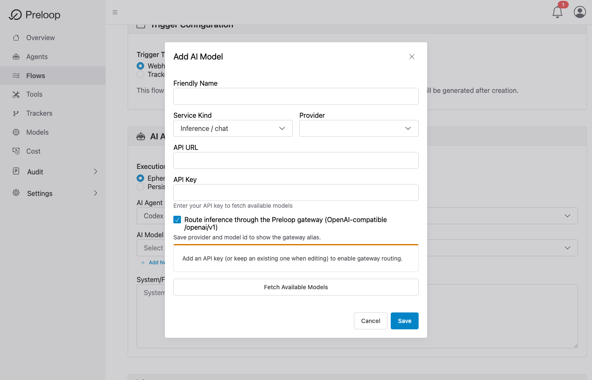
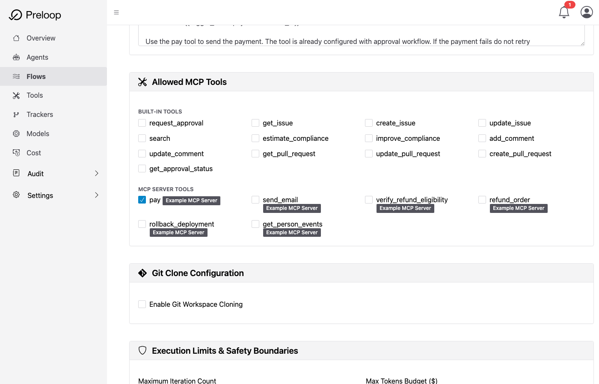
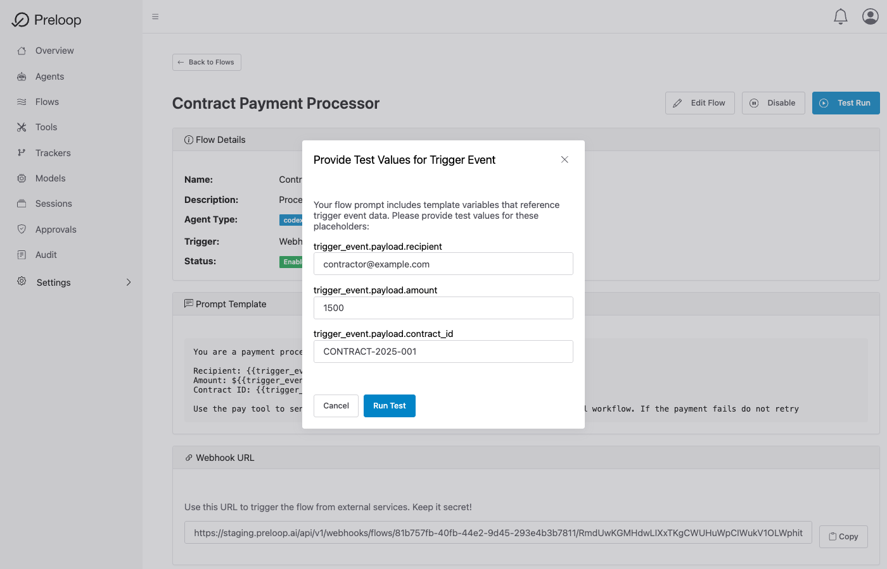
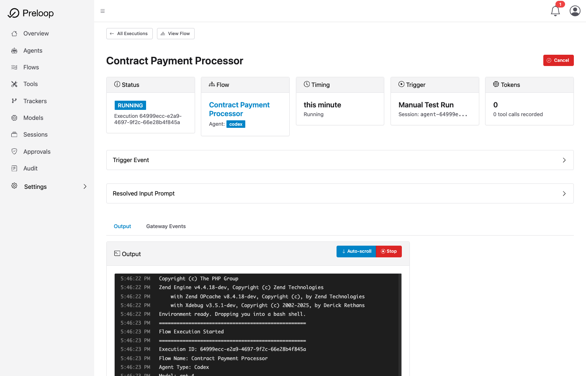
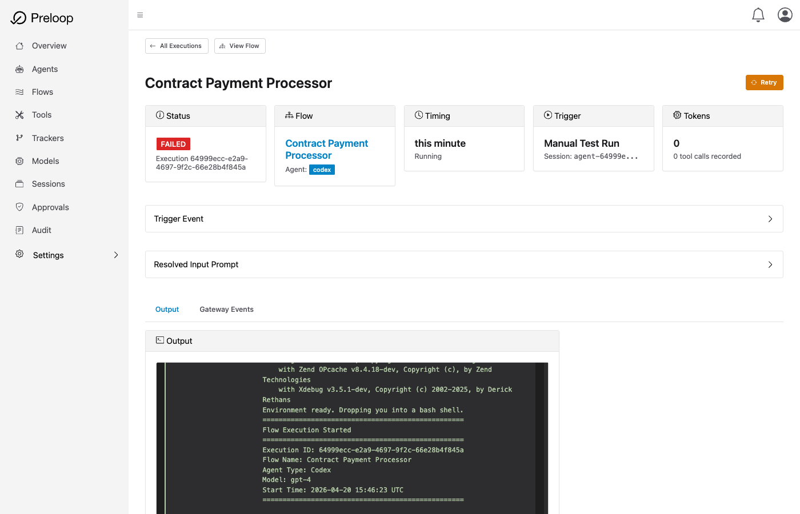

# Quick Start Part 2: Agentic Flows in 5 Minutes

Build an event-driven workflow that uses your protected tools with an AI agent.

!!! note "Prerequisites"
    Complete [Part 1: Safety Layer](quickstart.md) first to set up your account, policies, and protected tools.

!!! success "What You'll Accomplish"
    - Configure an AI model for your flows
    - Create an automated payment processing flow
    - Trigger the flow and see the approval workflow in action
    - Learn how to trigger flows via webhooks

---

## Step 1: Create Your AI Model (1 minute)

Flows need an AI model to execute tasks. Let's add one.

1. Navigate to **Flows** in the left sidebar
2. Click **+ Create Flow**
3. Click **Create from Scratch** (skip presets for now)
4. In the **AI Agent** section, you'll see "No AI models configured yet"
5. Click **+ Add AI Model**
6. Fill in:
    - **Name:** `GPT-5.4`
    - **Provider:** `OpenAI`
    - **Model:** Select a model from the dropdown
    - **API Key:** Your OpenAI API key

7. Click **Create**


*Adding and configuring a new AI model for your automated flows*

!!! info "Don't Have an OpenAI Key?"
    Get one at [platform.openai.com/api-keys](https://platform.openai.com/api-keys). The free tier is sufficient for testing.

**✓ Checkpoint:** You now have an AI model configured!

---

## Step 2: Create a Payment Approval Flow (2 minutes)

Let's create a flow that processes contract payments. If the amount exceeds your threshold, it will require approval.

**Flow Scenario:**

When triggered (manually or via webhook), the flow will:

1. Receive payment details (recipient, amount, contract_id)
2. Use the prelooped `pay` tool to send payment
3. If amount exceeds the condition, require approval first
4. Report the result

**Create the Flow:**

1. You're already on the Create Flow page. Fill in:

   **Basic Info:**

   - **Name:** `Contract Payment Processor`
   - **Description:** `Process contract payments with approval for large amounts`

   **Trigger:**

   - **Trigger Type:** Select **Webhook**
   - (The webhook URL will be generated after creation)

   **AI Agent:**

   - **AI Model:** Select the model you just created
   - **Prompt:** Enter this:

     ```
     You are a payment processor. Process the payment with these details:

     Recipient: {{trigger_event.payload.recipient}}
     Amount: ${{trigger_event.payload.amount}}
     Contract ID: {{trigger_event.payload.contract_id}}

     Use the pay tool to send the payment. The tool is configured with
     an approval workflow - small amounts are auto-approved, larger amounts
     require human approval.

     After payment completes, report the status. Do not retry if declined.
     ```

   **Tools:**

   - Ensure **pay** is checked
   - You can uncheck other tools if you want

2. Click **Create** at the bottom


*Creating an automated payment processor flow with AI model and approval-gated tools*

**✓ Checkpoint:** Your flow is created!

---

## Step 3: Test Your Flow (2 minutes)

Now let's trigger your flow and see the approval workflow in action!

**Trigger the Flow:**

1. You should now be on the flow details page (flows you create start enabled)
2. Click **Test Run**
3. You'll see a dialog asking for test values for the template variables
4. Fill in:
    - **trigger_event.payload.recipient:** `contractor@example.com`
    - **trigger_event.payload.amount:** `1500` (above threshold!)
    - **trigger_event.payload.contract_id:** `CONTRACT-2025-001`

5. Click **Run Test**


*Testing the flow with sample payment data - triggering the approval workflow*

**Watch the Execution:**

You'll be redirected to the execution page where you can see the AI agent working:

1. The agent will read your prompt
2. It will attempt to call the `pay` tool with amount=$1500
3. **Because you prelooped `pay` earlier**, you'll get an approval request!


*Flow execution in progress - AI agent is processing the request*


*Flow paused waiting for human approval before executing the payment*

**Approve the Payment:**

You'll receive an email: "Approval Required: pay"

1. Click **Approve** in the email, or:
   - Approve from the web dashboard
   - Approve from the [mobile app](clients/mobile-apps.md)
2. Go back to the flow execution page
3. Watch the agent complete the payment after your approval!

**✓ Checkpoint:** You've successfully run an automated flow with human approval!

---

## Triggering via Webhook

Your flow has a unique webhook URL. You can trigger it from external services!

1. Go back to your flow details page
2. Find the **Webhook URL** section
3. Copy the URL (looks like: `https://preloop.ai/api/v1/webhooks/flows/{flow_id}/{webhook_secret}`)

**Test with curl:**

```bash
curl -X POST 'YOUR_WEBHOOK_URL' \
  -H 'Content-Type: application/json' \
  -d '{
    "recipient": "vendor@example.com",
    "amount": 500,
    "contract_id": "CONTRACT-2025-002"
  }'
```

This payment will execute WITHOUT approval because it's below the threshold!

**Try with a larger amount:**

```bash
curl -X POST 'YOUR_WEBHOOK_URL' \
  -H 'Content-Type: application/json' \
  -d '{
    "recipient": "vendor@example.com",
    "amount": 2000,
    "contract_id": "CONTRACT-2025-003"
  }'
```

This one WILL require approval.

---

## Success! You've Built Safe Automation

You've just:

- **Set up the Safety Layer** - Protected a risky tool with policies (Part 1)
- **Built an automated workflow** - Created a flow with an AI agent
- **Tested end-to-end** - Triggered the flow, got approval request, watched it execute
- **Learned webhook triggers** - Can now trigger flows from external services

---

## What's Next?

**Learn the flow building blocks:**

Go deeper on how flows are created, triggered, and executed:

- **Creating Flows** - Build reusable AI-driven workflows
- **Flow Triggers** - Understand webhooks and other trigger types
- **Flow Execution** - Inspect status, history, and outcomes

[Creating Flows →](flows/creating-flows.md) | [Flow Triggers →](flows/flow-triggers.md) | [Flow Execution →](flows/flow-execution.md)

**Advanced Approval Workflows:**

Make approval smarter with conditional logic:

- Approve only if `environment == "production"`
- Different approvers for different amounts
- Team-based approval with quorum (require 2 of 5 approvers)
- Escalation chains

[Conditional Approval (CEL) →](approvals/cel-expressions.md) | [Team-Based Approvals →](approvals/teams.md)

**Connect Your Own MCP Servers:**

Preloop tools from ANY MCP server:

- Deployment tools
- Database operations
- Cloud provider APIs
- Your custom MCP servers

[External MCP Tools →](tools/external-mcp.md)

---

## Learn More

**Core Concepts:**

- [MCP Integration](../architecture/mcp.md) - How Preloop protects MCP tools with policies
- [Policy-as-Code](concepts/policy-as-code.md) - Generate and manage policies programmatically

**Flows:**

- [Creating Flows](flows/creating-flows.md) - Complete guide
- [Flow Triggers](flows/flow-triggers.md) - All trigger types
- [Flow Execution](flows/flow-execution.md) - Monitoring and debugging

**Advanced:**

- [Team-Based Approvals](approvals/teams.md) - Approver groups, inherited roles, and quorum behavior
- [Mobile Apps](clients/mobile-apps.md) - Approve from iPhone, iPad, Apple Watch, or Android
- [External MCP Tools](tools/external-mcp.md) - Protect tools from your own MCP servers

---

## Need Help?

- 📖 [Full Documentation](../index.md)
- 📧 [Support Email](mailto:support@preloop.ai)
- 💬 [Discord](https://discord.gg/P6nWSee4jv)
